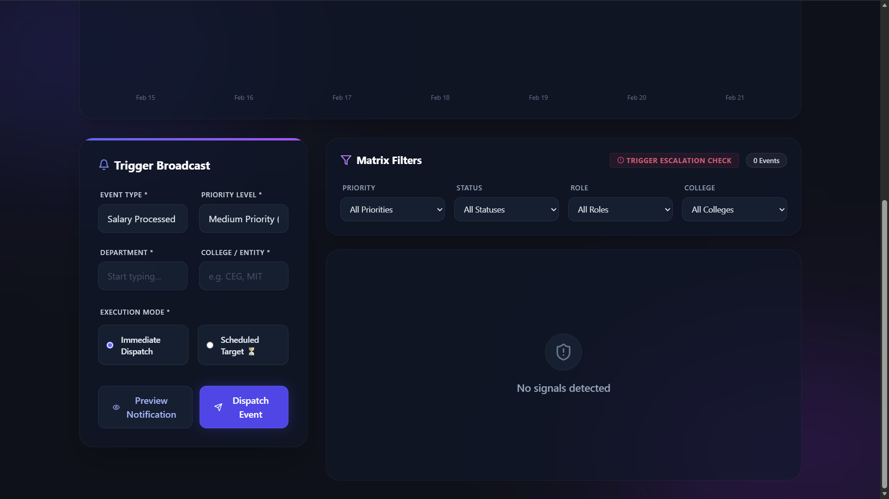
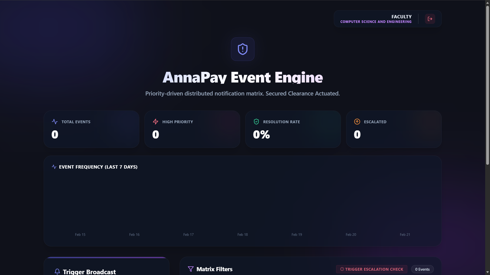
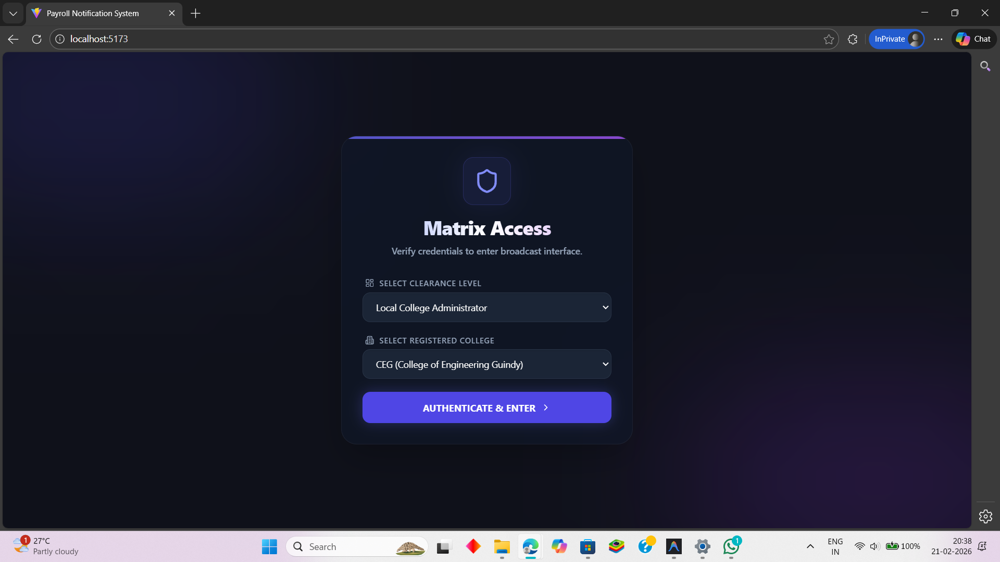

# AnnaPay Event Engine

Welcome to the **AnnaPay Event Engine**, a robust, real-time, event-driven notification matrix explicitly designed for Anna University's administrative, financial, and faculty ecosystem.

The system natively bridges autonomous **Backend Node.js CRON scheduling**, **Dynamic Rule Engines**, and **Persistent Supabase PostgREST Architecture** directly to a **React (Vite) Frontend** using live **WebSockets (Socket.io)**. 



---

## 🏗 System Architecture & Approach



This system abandons simple static CRUD notifications in favor of an **Active Event-Driven Pipeline**. When an event triggers anywhere within the AnnaPay ecosystem (e.g., `PAYROLL_FAILED` or `SALARY_PROCESSED`), the payload is routed through a series of intelligent backend intercepts:

1.  **Rule Engine Intercept**: Overrides requested priorities autonomously. If a user triggers a `PAYROLL_FAILED` event as "LOW" priority, the backend Rule Engine instantly destroys the request and forces it to **HIGH Priority** globally while dynamically adding `IT_SUPPORT` to the routing matrix.
2.  **Message Templating**: Injects dynamic context variables (`Target College`, `Target Department`) into secure JSON string templates so identical payloads format differently based on contextual delivery.
3.  **Role-Based Matrix Routing**: Validates whether the alert goes to a `UNIVERSITY_ADMIN` (receives everything) vs a `COLLEGE_ADMIN` vs `FACULTY`.
4.  **Omni-Channel Dispatch**: 
    - **Live WebSockets**: Pushes the alert straight into the React dashboard of active users natively without page refreshes.
    - **Email Mocking / Fallbacks**: Configurable adapter architecture ready to dispatch SendGrid/AWS SES fallbacks.
5.  **Autonomous Cron SLA Escalation**: If a `HIGH` priority alert sits in the database unresolved for over 3 hours, a background Node-Cron sweeper intercepts it, tags it `[ESCALATED]`, forces it back through the dispatch cycle, and alerts the `UNIVERSITY_ADMIN`.

---

## ✨ Core Features



*   **Secure Authorization Clearances**: Built-in contextual authentication. `FACULTY` logs merely show events targeting their department, whereas `UNIVERSITY_ADMIN` roles operate with absolute clearance and visibility. (Defaults to `COLLEGE_ADMIN` on open).
*   **Live Metrics Analytics Engine**: Top-level macro analytical cards summarizing Total Event Flow, Resolution percentages, Escalation volumes, and a live Recharts bar graph mapping the last 7-days of system frequency securely bound to the user's auth-clearance.
*   **Scheduled Dispatch Constraints**: Send alerts immediately, or bind them to a future `Datetime`. The API will safely park the event in Supabase and gracefully dispatch it through WebSockets later via the autonomous node-cron engine.
*   **SLA Auto-Escalation**: Strict automated sweeps handling priority breaches natively so critical technical/financial faults never get ignored.
*   **Immutable Audit Trail**: Every modification—whether creating an alert, marking it as resolved, pushing it via a scheduler, or escalating it—generates an undeletable, timestamped Audit SQL map tracking the exact `Actor_Identifier` and `Payload JSON`. 
*   **Expandable Data Cards**: Clean, glass-morphism aesthetic cards displaying nested priority strings, status mappings, and timestamp data.

---


## 🚀 Local Setup & Installation

Follow these steps to spin up the entire FullStack environment on your local machine.

### 1. Prerequisites 
- **Node.js**: `v18+` (Required for full compatibility)
- **Supabase Account**: You require an active cloud or local PostgreSQL instance.

### 2. Database Initialization (Supabase)
Run the migration SQL scripts located in the `supabase/migrations/` folder directly inside your Supabase SQL Editor. They **MUST** be run in chronological order:
1. `20260221124500_create_notifications_table.sql`
2. `20260221125200_anna_university_roles.sql`
3. `20260221143500_add_escalation_logic.sql`
4. `20260221144000_add_scheduling_logic.sql`
5. `20260221145000_add_audit_trail.sql` *(Required last for foreign keys)*

### 3. Environment Variables
Create a `.env` file natively in the root directory **AND** the `/backend` directory containing your keys:
```env
# Root directory (.env) for Vite React Frontend
VITE_SUPABASE_URL=your_supabase_project_url
VITE_SUPABASE_ANON_KEY=your_supabase_anon_key

# /backend directory (.env) for Node Express Server
SUPABASE_URL=your_supabase_project_url
SUPABASE_SERVICE_ROLE_KEY=your_supabase_service_role_key
PORT=3000
```

### 4. Boot Sequence

**Start the Backend Microservice (Terminal 1):**
```bash
cd backend
npm install
npm start
```
*You should see outputs proving the Express API is mounted on port `3000`, the Cron Scheduler is running, and WebSockets are actively listening.*

**Start the React Vite Frontend (Terminal 2):**
```bash
npm install
npm run dev
```
*The UI will mount at `http://localhost:5173`.*

---

## 🧪 Testing the Matrix
Once both servers are running:
1. Open up `localhost:5173`. You will instantly be logged in as a simulated `COLLEGE_ADMIN`.
2. Generate an event utilizing the UI Form as a `Scheduled Target ⏳`, setting the time for 1 minute in the future. 
3. Watch the Node terminal safely intercept the log seamlessly and blast the socket interface exactly on time.
4. Click the **View Audit Trail** button on the rendered card to parse the generated chronological tracking data!
